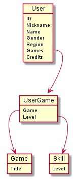

# Project: automatching
Code exercise for BESTSELLER

### Project setup:
By default, the service is located at `http://localhost:8080/` after running 'AutomatchingApplication' in your IDE

Tests:

The project includes 3 unit tests for the user controller and search controller.

> The program uses an H2 in-memory database, whose console can be accessed at `http://localhost:8080/h2-console`

Credentials:
- Username: **admin**
- Password: **admin**
- JDBC URL: **jdbc:h2:mem:testdb**
- Driver class: **org.h2.Driver**

### Documentation:
The program utilizes **OpenAPI 3.0** and **Swagger UI** for API documentation

> Swagger UI can be accessed at: `http://localhost:8080/swagger-ui.html`

> The pure OpenAPI 3.0 docs are available at `http://localhost:8080/api-docs/`

### Known issues:
- Task: **API to get the gamer with maximum credits for each game based on their levels** is not finished due to lack of time
- Issues with Id attributes auto incrementing across data models
- Swagger UI 'Try it out' supports posting id's which should be auto-generated by JPA
- Swagger UI 'Schemas' includes the DTO used to transfer search results
- Missing tests for services and repositories
- Only *MethodArgumentNotValidException* & Custom *AlreadyExistsException* are currently handled. Other exceptions result in '500 Internal Server Error'
- Security (including protection against malicious injection) has not been a big focus

### Super simplified 'domain model':

